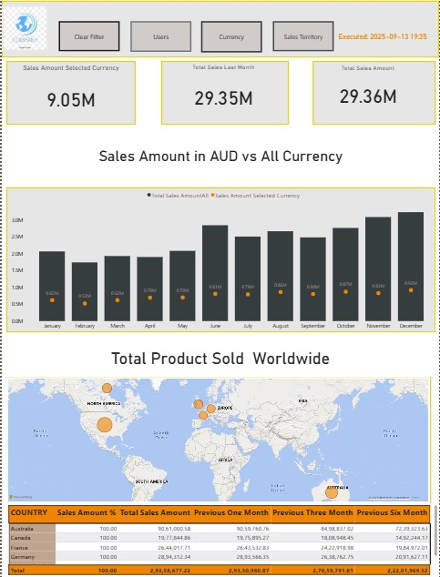
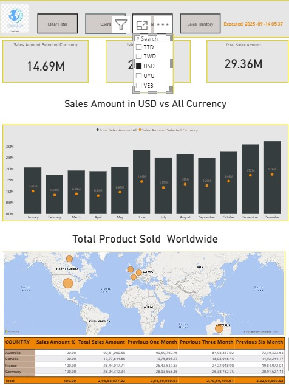

# 🌍 Power BI Sales Dashboard

## 📊 Project Overview
This **Power BI Sales Dashboard** provides an interactive, dynamic view of global sales performance across multiple currencies. The dashboard enables users to analyze sales trends, visualize product sales worldwide, and compare sales across different time periods and currencies.

---

## 🚀 Key Features
- ✅ **Dynamic Currency Selection**: Select any currency (USD, AUD, GBP, CAD, etc.) to view sales data accordingly.
- ✅ **Date-based Metrics**: View sales data from the last month, last three months, and last six months.
- ✅ **Interactive Map**: Visualizes total products sold worldwide with dynamic zoom and tooltips.
- ✅ **Clear Filter and Dynamic Buttons**: Allows easy filter management with bookmarks and action buttons.
- ✅ **Conditional Formatting & Custom Measures**: Visual cues based on selected filters and dynamic calculation of sales percentages.

---

## 🧱 Important DAX Measures

- **%Sales**  
  ```DAX
  %Sales = DIVIDE([TotalSalesAmount], [TotalSalesAmountAll]) * 100
  ```

- **Executed Timestamp**  
  ```DAX
  Executed = "Executed: " & FORMAT(NOW(),"YYYY-MM-DD HH:mm")
  ```

- **Map Title**  
  ```DAX
  MapTitle = "Total Product Sold " & IF(ISFILTERED(dim_SalesTeritory[SalesTerritoryCountry]), 
               "in " & VALUES(dim_SalesTeritory[SalesTerritoryCountry]), "Worldwide")
  ```

- **Previous Periods**  
  ```DAX
  PreviousOneMonth = CALCULATE([TotalSalesAmount], DATEADD(dim_Date[Date], -1, MONTH))
  PreviousThreeMonth = CALCULATE([TotalSalesAmount], DATEADD(dim_Date[Date], -3, MONTH))
  PreviousSixMonth = CALCULATE([TotalSalesAmount], DATEADD(dim_Date[Date], -6, MONTH))
  ```


- **Dim Date**
  ```DAX
  dim_Date = ADDCOLUMNS( CALENDAR(MIN(fact_InternetSales[ShipDate]),MAX(fact_InternetSales[ShipDate])), "Year",YEAR([Date]), "Month", MONTH([Date]), "Month Name", FORMAT([Date],"MMMM"), "Daye of week",     FORMAT([Date],"DDDD"), "Quarter", FORMAT([Date],"Q"), "YearQuarter", FORMAT([Date],"YYYY")&"/Q" & FORMAT([Date],"Q"))dim_Date = ADDCOLUMNS( CALENDAR(MIN(fact_InternetSales[ShipDate]),MAX(fact_InternetSales[ShipDate])), "Year",YEAR([Date]), "Month", MONTH([Date]), "Month Name", FORMAT([Date],"MMMM"), "Daye of week", FORMAT([Date],"DDDD"), "Quarter", FORMAT([Date],"Q"), "YearQuarter", FORMAT([Date],"YYYY")&"/Q" & FORMAT([Date],"Q"))
```


- **Currency-based Sales Calculation**  
  ```DAX
  SalesAmountSelectedCurrency = var SalesAmount = SUM(fact_InternetSales[SalesAmount]) var USDollars = CALCULATE(SalesAmount,dim_Currency[CurrencyAlternateKey]="USD") 
  var CADDollars = CALCULATE(SalesAmount,dim_Currency[CurrencyAlternateKey]="CAD") var GBP = CALCULATE(SalesAmount,dim_Currency[CurrencyAlternateKey]="GBP") 
  var AUD = CALCULATE(SalesAmount,dim_Currency[CurrencyAlternateKey]="AUD") 
  var DEM = CALCULATE(SalesAmount,dim_Currency[CurrencyAlternateKey]="DEM") var FRF = CALCULATE(SalesAmount,dim_Currency[CurrencyAlternateKey]="FRF") RETURN    IF(SELECTEDVALUE(dim_Currency[CurrencyAlternateKey])="USD", USDollars, IF(SELECTEDVALUE(dim_Currency[CurrencyAlternateKey])="CAD", CADDollars, IF(SELECTEDVALUE(dim_Currency[CurrencyAlternateKey])="GBP", GBP, IF(SELECTEDVALUE(dim_Currency[CurrencyAlternateKey])="AUD", AUD, IF(SELECTEDVALUE(dim_Currency[CurrencyAlternateKey])="DEM", DEM, IF(SELECTEDVALUE(dim_Currency[CurrencyAlternateKey])="FRF", FRF, "No Currency Selected"))))))
  ```


- **Title Bar
```DAX
   TitleBar = var CurrencySelected = IF(ISFILTERED(dim_Currency[CurrencyAlternateKey]),VALUES(dim_Currency[CurrencyAlternateKey]),
   BLANK()) RETURN IF(ISFILTERED(dim_Currency[CurrencyAlternateKey]),"Sales Amount in " & CurrencySelected & " vs All Currency", 
   "Please Select Currency from the Dropdown Menu")
   ```


---

## 🧱 Additional Features
- 📌 Bookmarks & Buttons for easy navigation and filter management.
- 🎯 Selection Pane & Edit Interaction for fine-tuned visual interactions.
- 🖌️ Conditional Formatting applied to tables for better readability.
- ⏱️ Timestamp that auto-refreshes when the report is run.

---

## 🌎 Visualizations
1. **Sales Amount Trend Chart**:  
   Compare sales amounts in selected currency vs. all currencies over months.
   
2. **World Map Visualization**:  
   Displays sales distribution by country, with bubbles sized by sales volume.

3. **Summary Cards**:  
   Display key metrics such as total sales in selected currency, total sales last month, and total sales overall.

---

## 🛠️ Tools & Technologies
- Power BI Desktop
- DAX (Data Analysis Expressions)
- Data Modeling with Calendar Table
- Interactive Buttons, Bookmarks, and Selections

---

## 📁 Data Source
The dashboard is powered by a sample dataset containing:
- Sales Amount by Currency  
- Sales Territory  
- Product Sales Date  
- Fact and Dimension tables

---

## 📸 Preview
  
https://github.com/sksamimali2000/Sales-Final-Dashboard/blob/main/Sales%20final%20Dashboard1.jpg


---

## 📂 Download Dataset
[Final Data Extract.xlsx](./Final Data Extract.xlsx)
https://github.com/sksamimali2000/Sales-Final-Dashboard/blob/main/Final%20Data%20Extract.xlsx

---

## 🔧 Future Improvements
- Add predictive sales analysis using ML models.
- Implement real-time data refresh from cloud sources.
- Expand currency support.

---

## 💡 Author
Created by **SK Samim Ali**  
📧 roy871858@gmail.com  
🔗 [LinkedIn Profile](https://www.linkedin.com/in/sk-samim-ali-25a9b2293/)

---

## ⭐️ Star the project if you found it useful!
